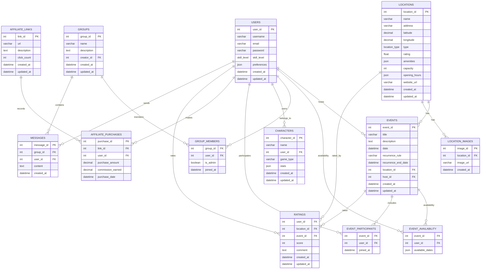

# barades

Fidélisez vos clients avec Bar à Dés, la plateforme dédiée aux bars à jeux !

Bar à Dés vous permet de mettre à disposition des clients votre catalogue de jeux, un système de réservation et offre une gestion d'évènements en ligne simple et efficace.

# Bibliographie

## UI/UX

* https://inclusive-components.design/
* https://www.a11yproject.com/

## Typographie

### Livres

* The Elements of Typographic Style - by Robert Bringhurst
* The Complete Manual of Typography - by James Felici
* Thinking with Type - by Ellen Lupton
* The Anatomy of Type - by Stephen Coles
* Type Matters! - by Jim Williams

### Sites

* https://www.reddit.com/r/typography/wiki
* http://www.insideparagraphs.com
* https://practicaltypography.com
* https://typographyhandbook.com
* https://fonts.google.com/knowledge
* https://eyelearn.org/typelab-by-hannahBoom

### Articles

- [Typographic Design Patterns And Best Practices — Smashing Magazine](https://www.smashingmagazine.com/2009/08/typographic-design-survey-best-practices-from-the-best-blogs/#comments-typographic-design-survey-best-practices-from-the-best-blogs)
- [The Ultimate Guide To Using Colors And Typography In 2024](https://inkbotdesign.com/colors-and-typography/)
- [Control font sizes, line spacing, and word spacing](https://openclassrooms.com/en/courses/5265446-build-your-first-web-pages-with-html-and-css/5282851-control-font-sizes-line-spacing-and-word-spacing)
- [The Complete Guide to Typography Design - AND Academy](https://www.andacademy.com/resources/blog/graphic-design/what-is-typography-design/)

### Design system

- [Spectrum](https://spectrum.adobe.com/page/typography/)
- [Apple](https://developer.apple.com/design/human-interface-guidelines/typography)
- [Codex](https://doc.wikimedia.org/codex/main/style-guide/typography.html)
- [Fluent 2](https://fluent2.microsoft.design/typography)
- [Firefox](https://acorn.firefox.com/latest/styles/typography/overview-gkJ3PjFB)
- [Atlassian](https://atlassian.design/foundations/typography)
- [Primer](https://primer.style/foundations/typography)
- [Carbon](https://carbondesignsystem.com/elements/typography/overview/)
- [Shopify Polaris](https://polaris.shopify.com/design/typography)
- [A11Y Style Guide](https://a11y-style-guide.com/style-guide/section-general.html#kssref-general-typography)
- [Design Systems Typography Guide](https://www.designsystems.com/typography-guides/)

# Cahier des charges

## Organisation de Sessions de JDR

* **Création et gestion d'événements** : Configure des sessions de jeu de rôle avec des options de personnalisation (date, lieu, maître de jeu, etc.).
* **Accessibilité pour les joueurs** : Permet aux joueurs de rejoindre des sessions en fonction de critères comme l'accessibilité et le niveau de compétence.
* **Statistiques de participation et fréquentation** : Offre des tableaux de bord permettant de visualiser les sessions les plus populaires et les préférences des joueurs.

## Répertoire des Bars à Jeux et Salles de Jeux

* **Base de données des lieux** : Liste des bars à jeux et espaces ludiques, avec leur adresse et catalogue éventuel. Possibilité d'ajouter des lieux de rencontre privé.

## Carte Interactive des Lieux de Jeux

* **Carte interactive** : Offre une carte permettant de localiser facilement les lieux proches, avec des options de filtrage selon l'environnement et les préférences d’accès.
* **Visualisation géographique** : Permet aux utilisateurs de consulter directement la carte des bars et salles de jeux depuis la plateforme.
* **Navigation fluide** : Intègre des API de cartographie pour une navigation interactive et intuitive.
* **Évaluation des sessions et lieux** : Permet aux joueurs de noter les sessions et les lieux, afin d'améliorer la qualité des expériences de jeu.

## Création de Groupes et Annonces de Parties

* **Doodle** : Trouver une date de rencontre correspondant à tout les joueurs
* **Formation de groupes de joueurs** : Facilite les rencontres entre joueurs ayant des affinités ou préférences de jeu similaires.
* **Annonces d’événements** : Permet de publier des annonces pour recruter des joueurs et organiser des campagnes.

## Liens Affiliés pour l’Achat de Matériel de Jeu

* **Système d’affiliation** : Propose des liens affiliés vers des sites de vente de matériel de jeu (dés, manuels, accessoires).
* **Tableau de bord** : Suivi des liens affiliés et recommandations personnalisées pour les utilisateurs.

## Outils de Création de Fiches de Personnages

* **Générateur de fiches personnalisées** : Crée des fiches de personnages adaptées à différents types de jeux de rôle.
* **Options de sauvegarde et impression** : Propose des options de mise en page personnalisée pour chaque style de jeu, avec sauvegarde et impression.

## Autres Fonctionnalités (Optionnelles)

* **Chat en temps réel** : Fournit un espace de discussion pour la préparation des parties entre membres d’un groupe.
* **Parties en ligne en temps réel** : Tokens, cartes, gestion des campagnes, lancés de dés..

# Consignes techniques pour le rapport de TFE

## Les règles typographiques

* Utilisez une police de caractères facile à lire, telle que Times New Roman, Arial ou Calibri. La taille de police standard est généralement de 12 points pour le texte principal.
* Respectez les marges standard. Généralement, les marges supérieure, inférieure, gauche et droite sont de 2,5 à 3 cm.
* Justifier votre texte
* Utilisez une hiérarchie de titres et de sous-titres pour organiser le contenu de votre TFE
* Utilisez des tailles de police plus grandes, des mises en gras...tout en restant cohérents.
* Utilisez des puces ou des numéros pour organiser les listes à puces ou les listes numérotées. 
* Assurez-vous que les éléments de la liste sont cohérents en termes de style et de format.
* Utilisez des notes de bas de page pour fournir des informations supplémentaires ou des explications sur certains points du texte principal. Numérotez les notes de bas de page de manière séquentielle dans tout le document.
* Numérotez et légendez toutes les illustrations (figures, graphiques, etc.) et les tableaux inclus dans votre TFE.
* Assurez-vous que leur placement dans le texte est logique et qu’ils sont facilement référencés depuis le corps du texte.(Voir table des figures)
* Relisez attentivement votre TFE pour corriger les fautes de frappe, de grammaire, de syntaxe et de ponctuation. 

## Plagiat / Utilisation de l’I.A.

* Chaque fois que vous utilisez les idées, les mots ou le contenu provenant d'une source externe, vous devez citer correctement cette source. Cela inclut les citations directes, les paraphrases, les idées originales et les images.
* Lorsque vous citez directement le texte d'une source, utilisez des guillemets pour indiquer qu'il s'agit d'une citation textuelle, et fournissez une référence bibliographique complète pour indiquer la source.
* Si vous reformulez les idées ou le contenu d'une source dans vos propres mots, assurez vous de fournir une référence appropriée pour indiquer la source originale.
* Utilisez des outils de détection de plagiat pour vérifier votre travail avant de le soumettre. Ces outils peuvent identifier les similitudes entre votre travail et d'autres sources en ligne, vous aidant à repérer toute forme de plagiat involontaire.•Même si vous utilisez une source secondaire qui cite une autre source, assurez vous d'attribuer correctement le crédit à la source originale.
* Assurez vous que le contenu de votre TFE est original et que vous apportez une contribution unique au domaine. Évitez de simplement reproduire ou résumer le travail d'autres auteurs sans ajouter votre propre analyse ou interprétation.
* Lorsque vous reprenez les propos d’une intelligence artificielle vous paraphrasez l’extrait de celle-ci, vous devez insérer un numéro de note de bas de page en exposant à la fin de cet extrait.

Ce numéro est reporté en bas de page où sont mentionnés:

* Quelle intelligence artificielle a été utilisée
* Date de consultation
* Date de la dernière mise à jour de sa base de données
* Pourquoi l’avoir utilisée

Exemples :

-Pratique

Chat GPT, 22/04/2024, 01/2022, «L’utilisation de l’intelligence artificielle m’a permis de calculer l’âge d’un individu via sa date de naissance»

-Théorique

Chat GPT, 22/04/2024, 01/2022, « L’intelligence artificielle m’a permis de reformuler la phrase. »

# Design

www.figma.com/files/team/1454055523810864494/project/313267721?fuid=758773516799124001

# Diagramme de BD

https://dbdiagram.io/e/6782723d6b7fa355c393418a/678b8ca46b7fa355c34870e7

# Roadmap

https://github.com/orgs/thinkerers/projects/7/views/1
